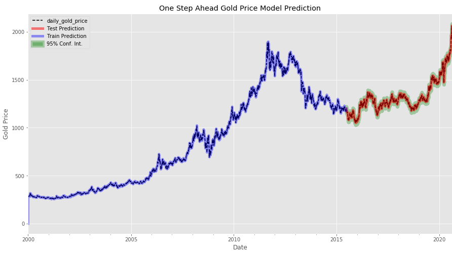

# Predicting Gold Price with Univariate Time Series Forecasting README

## Overview

**Background**

2020 has been a year of multiple uncertainties mainly driven by the onset and aftermath of the COVID-19 pandemic that has disrupted daily activity for nearly everybody in multiple ways. For one, the global economic impact of such a destructive force has been easily observed and well documented throughout this year. This includes, but is not limited to, a plethora businesses shuttering doors, millions of individuals out of work, unpaid rents, delinquent mortgages, negative gas prices, and bare store shelves. The list goes on.

The Federal Reserves response was to inject whatever amount of stimulus money into the system (trillions so far in this fiscal year alone) it would take to prop up a failing economy. That said, precious metals have been a historic safe haven for investors during times of increasing volatility and future uncertainty. Most notably, it provides a hedge against the debasement of fiat currency, while preserving the value of ones wealth.

As the Federal Reserve continues to dilute the value of the American Dollar, many are fleeing for safe havens outside of the current system; this typically starts with the flight into gold and gold assets then trickles down to silver along with other precious metals and hard assets. The influx of open interest has already been seen in 2020 with gold reaching all time nominal highs of over $2000/oz in August of this year. 

**Focus**

An investment firm has been closely watching the global economic turmoil unravel, and is interested in allocating a percentage of their capital into gold to take advantage of the current precious metals bull market. They're interested in where the price of gold could go over the next year to determine near term risk and reward potential.

This analysis aims to use a Time Series modeling technique known as ARIMA (Auto-regressive Inegrated Moving Average) to as accurately as possible predict the price of an ounce of gold between August 2020 and January of 2022.


# Data

Gold prices are set twice a day (A.M. and P.M.) by the London Bullion Market and are based in nominal U.S. dollars starting from 1968 up to the present. Data for gold prices used in this project are located on the Federal Reserves website (https://fred.stlouisfed.org/series/GOLDAMGBD228NLBM), and a copy is located in the project folder named 'GOLDAMGBD228NLBM.csv'.


* From the initial data load, the data appears be indexed in datetime format, contains 13665 observations, with some null values marked with '.'. The data type is also listed as an object; the null values and the data type must be addressed during the data preparation phase.

# Scrub Data

The data scrubbing process didn't take much, but the steps include:
* Replace '.' with nan values
* Convert data type from object to float
* Forward fill nan values

# Data Exploration


* The initial line plot visualization reveals an overall upward trend of the gold price, as well as significant periods of volatility. Both must be taken into consideration during the modeling process.

## KDE


* An initial look at the kde plot reveals that distributions of gold price are clearly not Gaussian. In fact, there seems to be a bimodal distribution heavily skewed toward the left. This means that some type of transform should be performed on the data to ensure it fits with time series assumptions.

## Box Plot

* Grouping the data by year and visualizing the box plots may help get an idea of the spread of gold price annually and how it may be changing over time. 


* Box plot observations reveal two major periods of high volatility and price variance between 1979-1982 and 2006-present. The majority of years show a very different signature of low volatility and variance. It's possible that prices prior to 2000 may not be beneficial for forecasting and can possibly be clipped prior to modeling.

## Lag Plot

* Time series modeling assumes a relationship between an observation and the previous observation. Previous observations in a time series are called lags, with the observation at the previous time step called lag1, the observation at two time steps ago lag=2, and so on.


* If the points cluster along a diagonal line from the bottom-left to the top-right of the plot, it suggests a positive correlation relationship.


* As expected, a quick look at the lag1 plot suggests a string, positive correlation between observations. This indicates some level of differencing must occur during the modeling process.

## Stationarity Check

* Time series modeling for accurate forecasting requires the data to be stationary. This is achieved when the statistical properties of mean, variance, and covariance remain constant over time. Stationarity can be tested in a variety of ways, however in this case the Dickey-Fuller test will be used. The null hypothesis for this test assumes that the provided data are not stationary. To reject the null hypothesis and confirm that the data are stationary, the test statistics must be less than the critical value of p < 0.05. 


* From the above graph, neither the mean nor the standard deviation are constant. Also, the p-value of the Dickey-Fuller test is well above the 0.05 threshold; this confirms that the gold data are not stationary, and as confirmed by the above graphs, must be transformed prior to modeling.

# Models

## Baseline

* Prior to manipulating the data, or getting into analysis, it's good practice to establish a baseline level performance known as a naive forecast in time series modeling. This provides the lowest benchmark for future model evaluation. 


* With this naive forecast, observations from the previous time step are used as the prediction for the next observed time step.


* The baseline model achieved an RMSE of 14.114. The lower the RMSE value (closer to 0), the better. Moving forward, achieving a value below 14.114 means a better model than the baseline has been established for forecasting gold prices.

## ARIMA

* Running a grid search to determine optimal pdq parameters on the the original data ended up taking far too long. Cutting down the data to model starting from gold prices between 1968-2020 down to only including 2000-2020 allowed for faster computing time. 


* Optimal pdq orders for modeling ended up being ARIMA(3, 1, 3).

## One Step Ahead Forecasting with ARIMA(3, 1, 3)

* After splitting the data into 75% train and 25% test sets, there are 4035 observations in the training set and 1345 observations in the test set.



* The one-step ahead forecast aligns with the test values as seen in the above graph.

* This model improved the rmse by 3, from 14 to 11.Though, this is an improvement, it may not be statistically significant from the baseline model. Especially for the amount of time and computational power it took compared to the first iteration.

## Dynamic Forecast

* Looking deeper into  the model will provide more insight into the true predictive power of the generated model. This can be achieved through dynamic forecasting where only information from the time series up to a certain point is used, and after that, forecasts are predicted using values from the previous forecast. 


* Though the dynamic forecast captures the upward trend of gold prices between 2015 and today, the fluctuation and volatility seen in the test set is not captured. 
* This result could come from a few different issues:

     * The provided data have no associated detectable trend or seasonality -- lack of complexity
     * Inappropriate use of modeling parameters leading to a disruption in trend and seasonality detection      
     * With only a single variable, ARIMA models have a hard time accounting for volatility
     * Undetected seasonal component to data due to data sampling interval


* These issues will need to be addressed in subsequent model iterations to provide more accurate forecasting of gold price.

## One Year Future Forecast


**Results**
* The spot gold price as of 9/17/2020 is 1952.84. The upper limit of the confidence interval projects gold at 2588.33 in one year, whereas the lower limit is 1714.67, and a mean of 2151.50


* Potential upper limit ROI: 32.54%
* Potential lower limit ROI: -12.2%
* Potential average ROI: 10.17%


# Conclusion

Having used the ARIMA model for time series analysis on predicting future gold prices, it's clear from the lack of captured volatility in the results that further model refinement must be performed or an entirely different modeling technique should be implemented.


The first issue that arose was lengthy computational time during the grid search model selection process. This was dealt with by cutting down the amount of data being analyzed. Since the behavior of gold had a different signature (low volatility) prior to the year 2000, prices were cut down to only include years from 2000 to today.


Running a grid search on the slimmed down data found the optimal pdq modeling parameters to be ARIMA(3, 1, 3). After modeling, the measured p-values indicated the data was stationary, however residual plots showed the model had trouble accounting for the extreme volatility in gold price seen in recent years. This was confirmed when forecasted values graphed as a smooth upward trending line. This could be due to a variety of issues:

 * The provided data have no associated detectable trend or seasonality -- lack of complexity
 * Inappropriate use of modeling parameters leading to a disruption in trend and seasonality detection      
 * With only a single variable, ARIMA models have a hard time accounting for volatility
 * Undetected seasonal component to data due to data sampling interval

One positive is that the model captured the current upward trend of gold prices. Using the confidence interval around the forecasted gold price can provide insight into the upper and lower limits of future gold prices. These limits alone can help furnish the starting point for the extend of risk versus reward for near term gold investing.

Current model 1 year gold price predictions using gold price as of 9/17/2020 (1952.48):
  * Lower limit ROI (1714.67) - -12.2%
  * Average ROI (2151.50) - 10.17%
  * Upper limit ROI (2588.33) - 32.54%

The current model reveals there's more upside potential than downside risk in investing a portion of a portfolio into the gold sector. This can help hedge against market volatility and currency debasement.

# Recommendations

Computing power was a major limitation during the modeling process. This greatly increase modeling computational time and may have hindered the models ability to find the most optimal parameter orders for an accurate forecast. It's recommended to invest in more powerful hardware to decrease computational time while increasing the ability for to search more thoroughly for optimal modeling parameters.


The ARIMA modeling technique may not be the correct selection for this specific task. It had a difficult time predicting the volatility of gold price seen in more recent years. One possible solution is to try different models that specifically account for more variance in price action such as the Autoregressive Conditional Heteroskedasticity (ARCH) method. The ARCH model is specifically designed to take into account volatility by modeling residual error variance at each step in time. 


The value of gold is widely known to be influenced by many factors including: inflation rates, U.S. dollar strength, investment demand, mine supply, central bank purchases, and overall economic sentiment. Forecasting gold may be too complex of a problem for univariate time series modeling. Therefore, switching to a multivariate time series method could more accurately predict volatility and capture the momentum of gold either to the up or the down side.

Increasing computing power while exploring more complex modeling techniques will yield better forecasting results which will better aid investors to make a more informed decision on allocating a percentage of their portfolio to exposure in the gold space.


```python

```
